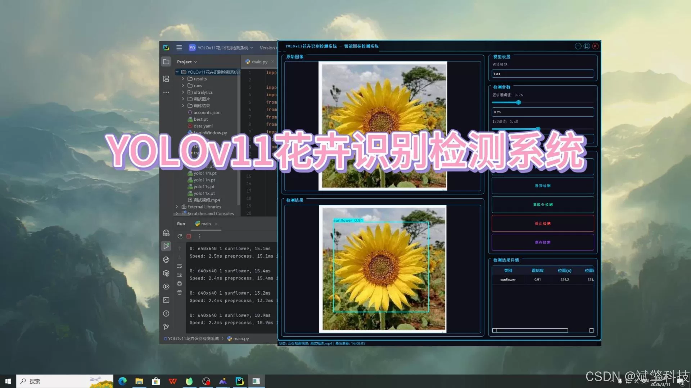
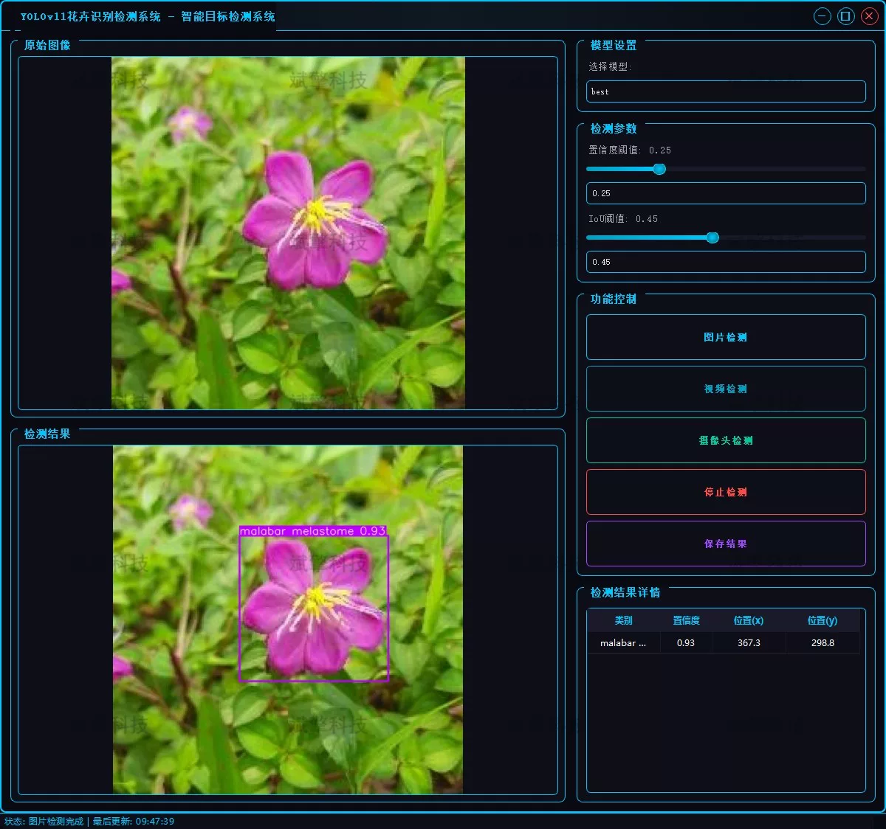
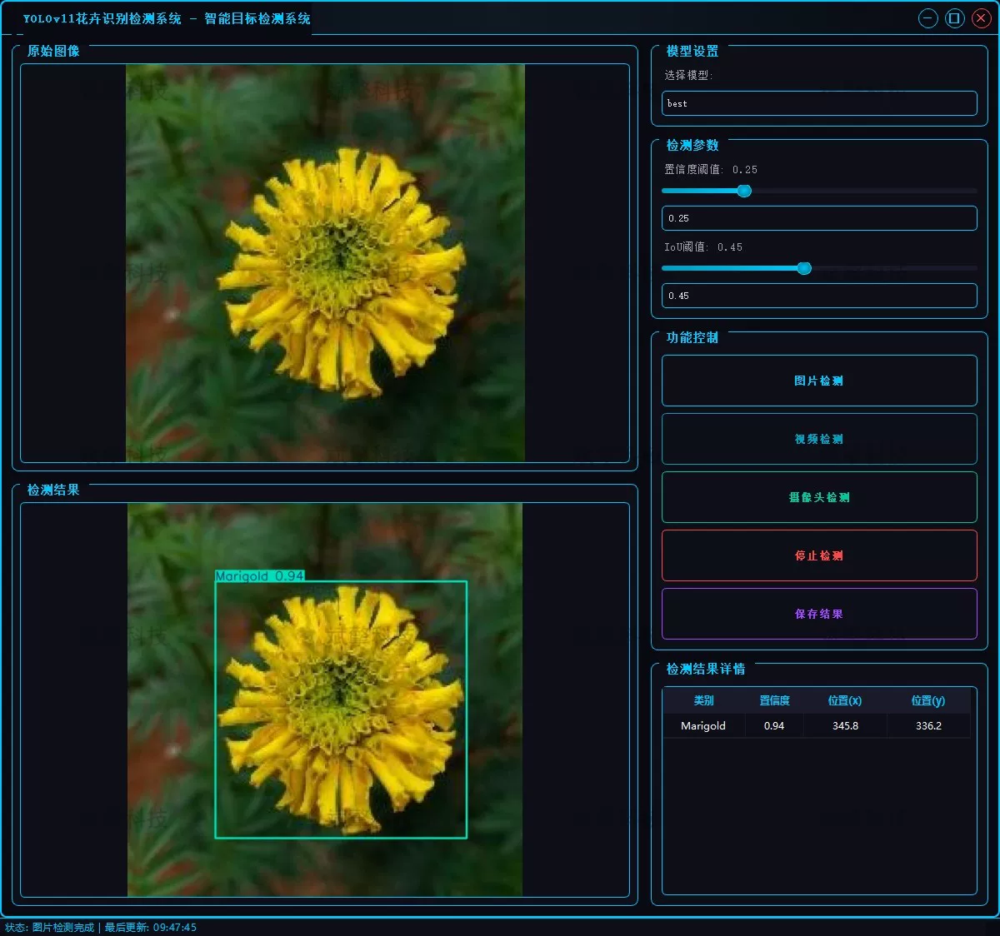
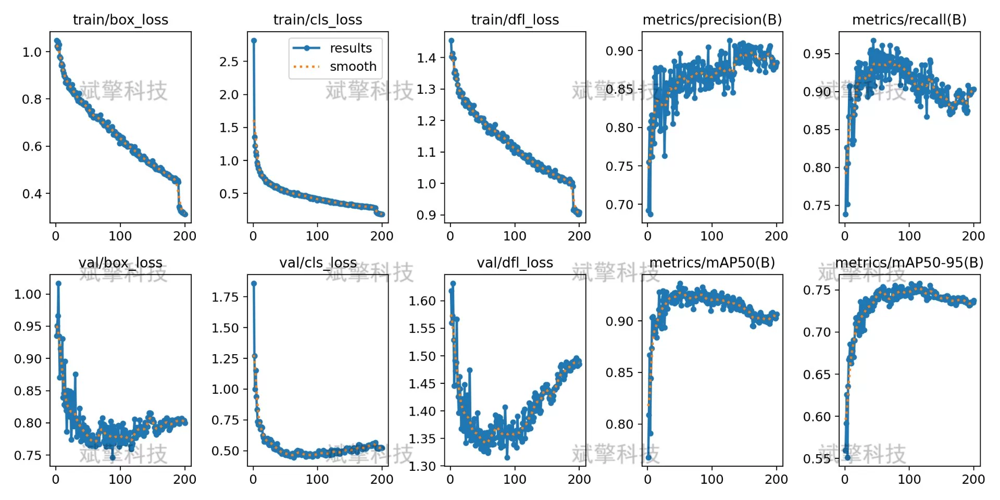

# YOLOv11 Flower Recognition System

## Body

YOLOv11 Flower Identification System, based on the YOLOv11 deep learning algorithm for flower identification detection system (YOLOv11+YOLO dataset + UI interface + login registration interface + Python project source code + model).

This project has developed a smart flower identification detection system based on the advanced YOLOv11 deep learning target detection algorithm. The system can accurately and real-time identify 13 different types of flowers, including common ornamental flowers such as Hibiscus tiliaceus, Hibiscus rosa-sinensis, Acacia mangium, Marigold, Rose, etc., as well as some regional characteristic flowers such as Jasminum nudiflorum, Strobilanthes cusia, Chrysanthemum indicum, and Malva parviflora. Through the application of deep learning technology, this system realizes high-precision automatic detection and classification of flowers, which can be widely applied in many scenarios such as intelligent guide tours in botanical gardens, surveys of garden plants, monitoring of flower planting, and mobile phone flower recognition applications.

Project Functionality Exhibition

✅ User Login and Registration: Support password verification and security validation.

✅ Three Detection Modes: Based on the YOLOv11 model, support image, video, and real-time camera detection, with precise target recognition.

✅ Dual Screen Comparison: Display original images and detection results on the same screen.

✅ Data Visualization: Real-time table displaying the category, confidence, and coordinates of detected targets.

✅ Intelligent Parameter Tuning: Provide a confidence slide bar to dynamically optimize detection accuracy, adapting to different scene needs.

✅ Sci-Fi Interactive Interface: Dark theme combined with dynamic light effects, reducing visual fatigue and improving operational experience.

✅ Multi-thread High-Performance Architecture: Independent detection threads ensure smooth operation, real-time status prompts, and fast response without lag.

Dataset Introduction

Training set (Train): 1892 images, used for model training and learning
Validation set (Val): 529 images, used for model parameter tuning and validation
Test set (Test): 326 images, used for final model performance evaluation

## Images

## Payment

Here is a pay link on Stripe ( https://buy.stripe.com/3cs8yP7sY87d0vu9AB ). Please contact me lonlonago@foxmail.com after funding $89, and I will send you a complete data files , thank you!

